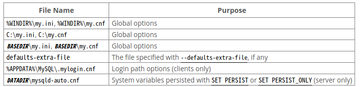
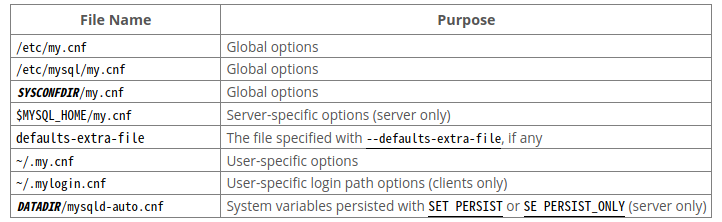

# 1、命令行参数规则

- *后来居上*：同一个参数被多次设定，或者设定互相冲突的参数时，后者会覆盖前者
```shell
mysql -h example.com -h localhost
mysql --column-names --skip-column-names
```

- 参数的取值包含空格时，需要用引号包括取值
- 在命令行设置密码时，  **-P** 与密码之间不能有空格，否则密码会被认为需要连接的库名
- 参数中的连接符可以用下划线代替，如 **--skip-grant-tables** 与-**-skip_grant_tables** 具有同等效果

- 系统变量只能用下划线、而不能用连接符
```
# 在命令行设定MySQL系统变量
shell> mysql --general_log=ON 
# 在MySQL中设定系统变量
mysql> SET GLOBAL general_log = ON;
# 在MySQL中查询系统变量
SELECT @@GLOBAL.general_log;
```

- 使用数值的参数在设定数值时可以附加单位，如
```shell
# ping MySQL服务1024次，每次间隔10秒
mysqladmin --count=1K --sleep=10 ping
```

# 2、配置文件

MySQL默认按照以下路径依次加载配置文件，注意：
- **mysqld-auto.cnf** 是由MySQL服务器创建的JSON格式的文件,记录持久化的系统变量
- **.mylogin.cnf** 一般是由 **mysql_config_editor** 创建的加密文件
```shell
-G，–login-path=name 在登录文件中的登陆入口名称（默认为client）
-h,–host=name 添加host到登陆文件中
-P，–port=name 添加登陆端口到登陆文件中
-u，–user 添加用户名到登陆文件中
-p,–password 在登陆文件中添加密码（该密码会被mysql_config_editor自动加密）
-S,–socket=name 添加sock文件路径到登陆文件中

# 查看当前主机上的加密文件
mysql_config_editor print --all 
# 设置名称为remote的登陆入口
mysql_config_editor set --login-path=remote  -h host -P port dbname
# 使用登陆入口直接登陆
mysql --login-path=remote 
# 删除名称为remote的登陆入口
mysql_config_editor remove --login-path=remote
# 删除所有登陆入口
mysql_config_editor reset 
```




以下是几个示例配置文件，注意：
- 所有的 *长命令* 都可以卸载配置文件中
- 配置文件里，参数的取值中可以使用转译字符，如路径中含有空格时可以用 **\s** 表示
- **\[client\]**下的内容将传递给所有除了 **mysqld** 之外的MySQL服务
- 使用 **--print-defaults** 参数，查看启动时使用的默认参数
- 使用 **--no-defaults** 参数，禁用默认参数
- 使用 **--login-path=name** ，指定 **.mylogin.cnf** 文件的位置，从而决定要连接哪个服务器


```
#### 在配置文件中引用其它路径下的配置文件 ####
!include /home/mydir/myopt.cnf
!includedir /home/mydir/


#### 全局配置文件示例 ####

[client]
port=3306
socket=/tmp/mysql.sock

[mysqld]
port=3306
socket=/tmp/mysql.sock
key_buffer_size=16M
max_allowed_packet=128M
datadir=～/mysqlDB/
tmpdir=～/mysqlDB/tmp/
basedir=/etc/mysql/ 

[mysqld-8.0]
sql_mode=TRADITIONAL

[mysqldump]
quick


#### 用户配置文件示例 ####

[client]
# The following password will be sent to all standard MySQL clients
password="my password"

[mysql]
no-auto-rehash
connect_timeout=2
```

# 3、服务器启动参数

```shell
--basedir 	            # MySQL 安装目录
--datadir 	            # 数据存放目录
--log-error 	          # 错误日志记录文件
--syslog 	              # 向操作系统日志体系中记录日志
--skip-syslog 	        # 不向操作系统日志体系中记录日志
--syslog-tag            # 向操作系统日志体系中记录日志时，日志的标识名
--pid-file 	            # 进程ID 文件存放路径
--port 	                # 建立TCP链接时，需要监听的端口号
--defaults-extra-file 	# 除配置文件之外还需要使用的配置文件
--defaults-file         # 仅使用指定的配置文件
--no-defaults 	        # 不使用配置文件
--core-file-size 	      # mysqld 所能创造的 core-file 文件大小
--open-files-limit 	    # mysqld 所能打开的最大文件数
--socket 	              # 建立 socket 链接时依赖的文档
--timezone 	            # 设置时区
--plugin-dir            # 扩展插件安装目录
--user                  # 以哪个用户的身份来启动mysqld
```

## 3.1、mysqld_multi

```shell
# mysqld_multi 命令格式，可以在配置文件中使用类似 [mysqld8] 的形式，指定MySQL服务器的GNR
mysqld_multi [options] {start|stop|reload|report} [GNR[,GNR] ...]
# 示例，关闭8、10、11、12、13号MySQL服务器
shell> mysqld_multi stop 8,10-13
```


# 5、客户端启动参数

```shell
mysql --column-names                # 查询结果中显示列名
mysql --column-names = 0            # 查询结果中不显示列名
mysql --loose-no-such-option        # 找不到参数时警告并忽略
```
